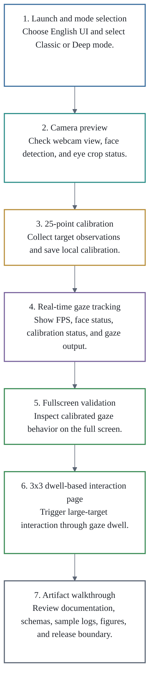

# Demonstration Workflow

The Look2Act screencast is designed as a 3-5 minute walkthrough of the Windows desktop prototype and this non-code demonstration artifact repository.

## Workflow Stages

| Stage | Demonstrated behavior | Review focus |
| --- | --- | --- |
| Launch and mode selection | The Windows desktop tool starts with English UI and Classic / Deep mode selection. | Confirms the explicit mode boundary and Windows desktop setting. |
| Camera preview | The tool displays webcam preview and detection status. | Shows camera readiness, face / landmark detection, and eye crop checking. |
| 25-point calibration | The tool collects calibration observations in a 5x5 target layout and stores calibration locally. | Shows the main demonstration calibration setting. |
| Real-time gaze tracking | The tool reports runtime status such as FPS, face status, calibration status, smoothing, and gaze output. | Shows the calibrated gaze visualization workflow. |
| Fullscreen validation | The tool displays calibrated gaze behavior in a fullscreen validation view. | Shows qualitative tracking behavior for gaze visualization. |
| 3x3 dwell-based interaction page | The tool triggers large-target interaction through gaze dwell. | Shows the end-to-end gaze-driven interaction path. |
| Artifact walkthrough | The screencast presents repository contents, sample schemas, sample logs, figures, and release boundary notes. | Shows what is included and intentionally excluded from the initial artifact. |

## Demonstration Boundary

The demonstration is intended for gaze visualization, large-target selection, and low-cost gaze interaction prototyping. It does not claim mouse-level precision, state-of-the-art accuracy, or replacement of infrared eye trackers.
