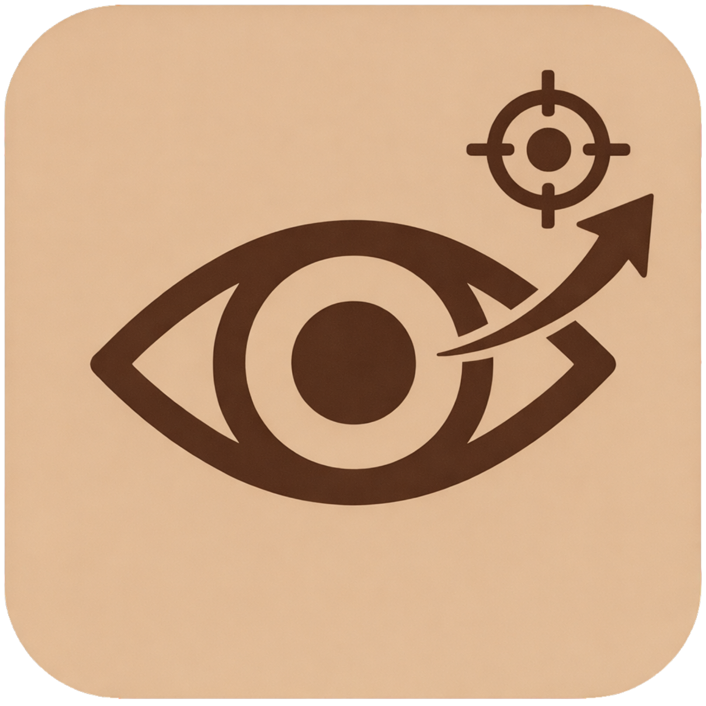
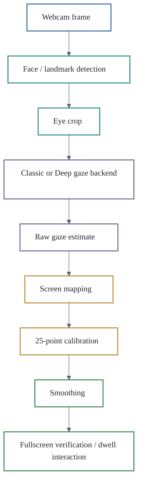

# Look2Act

**Webcam-based gaze visualization and gaze-driven interaction prototyping**

Look2Act is a Windows desktop tool for webcam-based gaze visualization and gaze-driven interaction prototyping. This repository provides the public demonstration artifact for the Internetware 2026 Tool Demonstration submission. It is not a source-code release.

## What Look2Act Demonstrates

Look2Act uses a standard webcam to estimate a user's screen gaze point and demonstrate gaze-driven interaction workflows. The current prototype is positioned for gaze visualization, large-target selection, and low-cost gaze interaction prototyping. It does not claim mouse-level precision, state-of-the-art accuracy, or replacement of infrared eye trackers.

The current platform boundary is Windows desktop only.

## Demonstration Workflow

Look2Act provides two modes:

| Mode | Purpose |
| --- | --- |
| Classic | Stable demonstration mode based on classic image-processing features. |
| Deep | Research-oriented mode using the GazeNetV2 gaze model. |

The main demonstration calibration setting is 25-point calibration. 9-point calibration is treated only as an experimental comparison.

## Current Artifact Contents

This initial submission artifact contains:

- Documentation package for reviewers.
- Demonstration workflow and screencast plan.
- English demonstration screenshots.
- Anonymized schemas for labels, metadata, and calibration logs.
- Synthetic sample logs.
- Preliminary aggregate evaluation summary.
- Release boundary, privacy, license, and limitation notes.
- English aggregate evaluation figures under `figures/`.
- Mermaid pipeline and demonstration workflow diagrams embedded in the Markdown documentation, with editable sources under `figures/`.

## Repository Guide

| Document | Purpose |
| --- | --- |
| [PROJECT_SUMMARY.md](PROJECT_SUMMARY.md) | Tool facts, platform boundary, dataset statistics, and preliminary evaluation numbers. |
| [REVIEW_GUIDE.md](REVIEW_GUIDE.md) | Reviewer-facing guide to inspecting the artifact. |
| [DEMONSTRATION_WORKFLOW.md](DEMONSTRATION_WORKFLOW.md) | Screencast and demonstration sequence. |
| [MEDIA_AND_MATERIALS.md](MEDIA_AND_MATERIALS.md) | Screenshots, figures, screencast material, schemas, and sample logs. |
| [RELEASE_BOUNDARY.md](RELEASE_BOUNDARY.md) | Initial artifact contents and release boundary. |
| [SECURITY_AND_PRIVACY.md](SECURITY_AND_PRIVACY.md) | Local-first privacy and security boundary. |
| [MODEL_AND_DATA_AVAILABILITY.md](MODEL_AND_DATA_AVAILABILITY.md) | Model and dataset availability boundary. |
| [LIMITATIONS.md](LIMITATIONS.md) | Current limitations of the demonstration artifact. |

## Not Released In The Initial Submission

The following materials are intentionally not released in this initial artifact repository:

- Source code.
- Full dataset.
- Raw eye-region or face images.
- Trained model weights.
- ONNX files.
- `.pth` files.
- Windows executable package.

The full dataset is not public because it contains real users' eye-region images and session/device metadata. Standalone model weights are not public at this stage. A Windows demonstration package is not included in the initial submission artifact.

## Links

- Paper: Internetware 2026 submission paper
- Screencast: (https://drive.google.com/file/d/1DjjuPsoB7M3zJUS3Ohix-e2r6DbhTU0c/view?usp=sharing).
- Screenshots: see [screenshots/](screenshots/)
- Windows demonstration package: not included in the initial submission artifact

## Privacy And Security Summary

The current prototype is local-first and does not require network access for the demonstrated functions. Webcam frames are processed locally. Calibration logs and configuration files are stored locally for the demonstrated workflow. Reviewers may block network access without affecting the core demo.

For details, see [SECURITY_AND_PRIVACY.md](SECURITY_AND_PRIVACY.md).

## Citation

Citation details will follow the final Internetware 2026 publication metadata.
